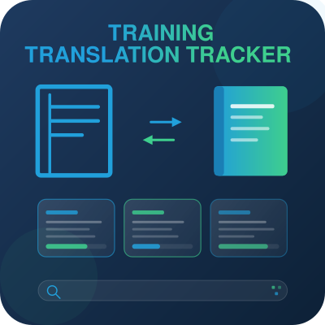

# Training Translation Tracker



Mono-repo for the inventory-driven translation dashboard of the WordPress DACH team. Two components, one repo:

1. **`action/`**, a GitHub Action (Python) that produces a `tracker.json` snapshot of all DACH translations. Runs every 12 hours and on pushes to relevant action paths.
2. **`wp-plugin/`**, a WordPress plugin that loads `tracker.json` and renders it on a WP page as a dashboard (cards, filters, search, collapse).

## Documentation

English documentation lives in [`docs/en/`](docs/en/), the German mirror in [`docs/de/`](docs/de/). Five documents, depending on your role:

| If you want to… | Then read… | Deutsch |
|---|---|---|
| understand the system, how it works and why it is built this way | [docs/en/Architecture.md](docs/en/Architecture.md) | [Architektur.md](docs/de/Architektur.md) |
| work on the code (Action-Python or Plugin-PHP/JS/CSS) | [docs/en/Developer.md](docs/en/Developer.md) | [Developer.md](docs/de/Developer.md) |
| operate the tool (releases, token maintenance, failure recovery) | [docs/en/Operations.md](docs/en/Operations.md) | [Operations.md](docs/de/Operations.md) |
| install the plugin on a WP site or maintain issues | [docs/en/User-Guide.md](docs/en/User-Guide.md) | [User-Guide.md](docs/de/User-Guide.md) |
| create a DACH translation issue | [docs/en/Issue-Templates-DACH.md](docs/en/Issue-Templates-DACH.md) | [Issue-Vorlagen-DACH.md](docs/de/Issue-Vorlagen-DACH.md) |

Both languages are maintained together: every documentation change updates the EN and the DE file in the same commit.

## Repository layout

```text
Training-Translation-Tracker/
├── .github/workflows/
│   ├── build.yml                 Builds tracker.json (every 12 h, config push, manual)
│   ├── release-plugin.yml        Builds the release ZIP on version tag push (v*)
│   └── plugin-tests.yml          Runs the PHPUnit suite on plugin changes
│
├── action/                       Python action, builds tracker.json on the data branch
│   ├── src/                      Inventory sources, issue parser, joiner, build entry point
│   ├── tests/                    pytest tests
│   ├── schemas/                  JSON schemas (tracker, scope, templates, status-map)
│   ├── scope.yml                 DACH scope: which URLs are tracked
│   ├── component-templates.yml   Default components per item type, icons
│   ├── status-map.yml            Board status → dashboard status (since 0.5.0)
│   ├── inventory-cache.json      Committed inventory snapshot
│   ├── requirements.txt
│   └── LICENSE
│
├── wp-plugin/                    WordPress plugin
│   ├── training-translation-tracker.php   Plugin header and boot
│   ├── includes/                 Settings, fetcher, status logic, styles, renderer
│   ├── assets/                   Frontend JS, admin JS, icons
│   ├── languages/                .pot, de_DE .po and .mo
│   ├── readme.txt                WordPress standard readme
│   └── LICENSE
│
├── plugin-tests/                 PHPUnit + Brain Monkey suite for the plugin
│                                 (outside wp-plugin/ so it never ends up in the ZIP)
├── docs/                         Documentation suite: en/ and de/
├── build-plugin-zip.sh           Build the plugin ZIP for WP upload
├── sync-schemas.py               Schema sync tool for maintenance
├── CONTRIBUTING.md
└── README.md                     This document
```

Not in the repo (in `.gitignore`):

- `training-translation-tracker.zip`, regenerated on every build.
- `.venv/`, `.pytest_cache/`, `.ruff_cache/`, `__pycache__/`, `vendor/`, tooling caches.
- `action/tracker.json`, `action/last-run.md`, `action/data-hygiene.md`, local action outputs (live on the `data` branch).

## Three-component pipeline

```
┌──────────────────────────┐    ┌──────────────────────────┐    ┌──────────────────────────┐
│  GitHub Issues (DACH)    │    │  GitHub Action (Python)  │    │  WordPress plugin (PHP)  │
│  Project V2 #104         │───►│  builds tracker.json on  │───►│  reads tracker.json,     │
│  Locale=German           │    │  data branch every 12 h  │    │  renders the shortcode   │
└──────────────────────────┘    └──────────────────────────┘    └──────────────────────────┘
       maintained by                  aggregation and                  rendered in
       translators                    schema validation                the frontend
```

The plugin makes **no** API calls to GitHub or learn.wordpress.org itself. Everything is precomputed by the action; the plugin is a thin renderer with a cache.

For a deeper introduction, see [docs/en/Architecture.md](docs/en/Architecture.md).

## Quickstart

### Test the action locally

```bash
cd action
python -m venv .venv
source .venv/bin/activate
pip install -r requirements.txt
python -m pytest -q                # run the test suite
python -m src.build --skip-issues  # builds tracker.json without a GitHub token
```

### Test the plugin locally (no Docker needed)

```bash
cd plugin-tests
composer install
composer test
```

### Build the plugin ZIP

```bash
./build-plugin-zip.sh
# → ~/Desktop/training-translation-tracker.zip
```

Install in WordPress admin via "Upload Plugin", step-by-step in [docs/en/User-Guide.md](docs/en/User-Guide.md). Releases are normally built by `release-plugin.yml` on a version tag push; the local script is for testing.

### Refresh the inventory cache (when scope.yml gets new URLs)

```bash
cd action
python -m src.build --refresh-cache    # only fetches missing URLs
git add scope.yml inventory-cache.json
git commit -m "Scope: new URLs"
git push
```

The action then triggers automatically and rebuilds tracker.json.

## Reporting bugs and ideas

Bugs, ideas and tasks for this tool are tracked as GitHub issues in this repository and managed on the [Training-Translation-Tracker Pipeline](https://github.com/users/rfluethi/projects/12) project board. Please open an issue here rather than posting in Slack. Note that the [WordPress project board 104](https://github.com/orgs/WordPress/projects/104/views/12) is for the translations themselves, not for this tool.

## Credits

The frontend UI design concept (card layout, status pills, component icons, filter bar interaction) is by **Andy Rudorfer** ([@Bigod](https://github.com/Bigod)). The implementation in PHP, CSS and JavaScript was carried out on top of that concept.

The component icons in the frontend use path data from [Material Icons](https://fonts.google.com/icons) (Apache License 2.0). Apache-2.0 is compatible with GPLv3; since this plugin is licensed "GPL v2 or later", distribution under GPLv3 covers the combination.

## License

GPL v2 or later, see `action/LICENSE` and `wp-plugin/LICENSE`.
